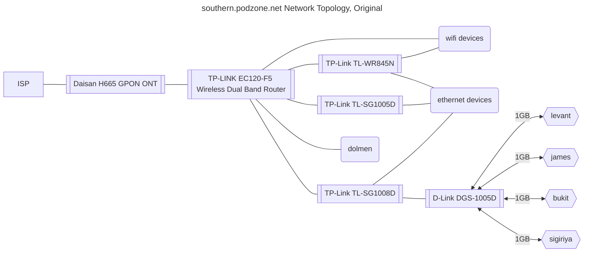
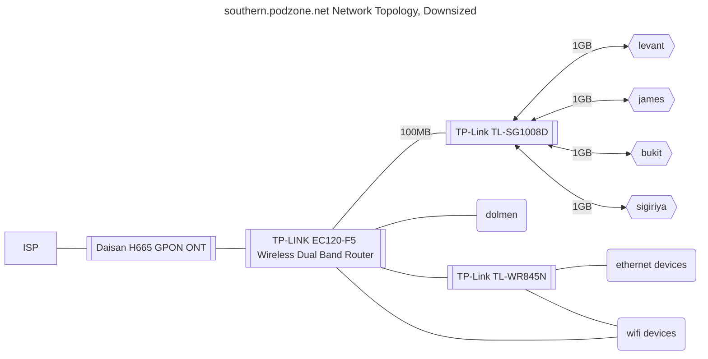
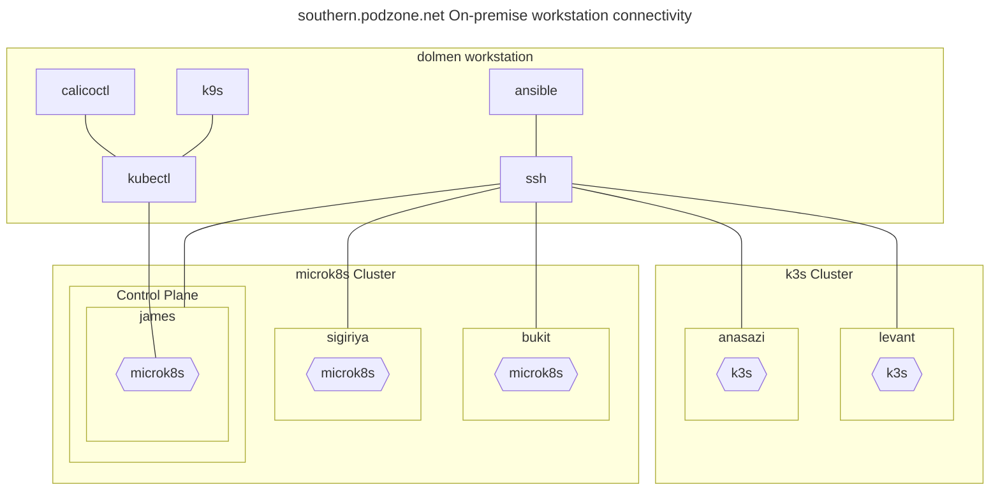
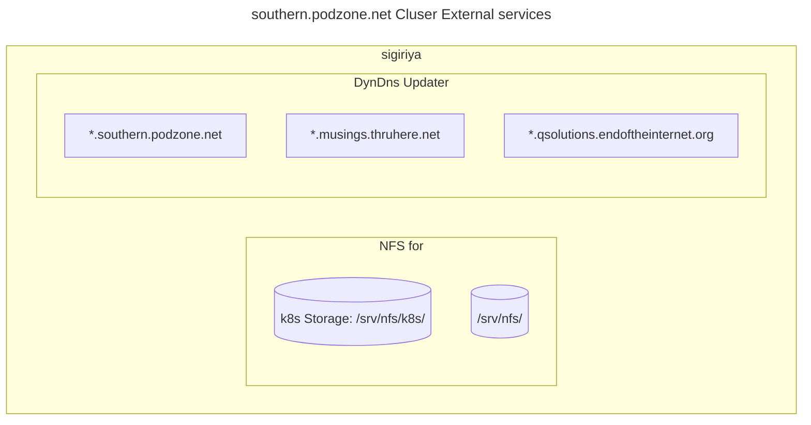

# Consumer Cloud Zone 1: southern.podzone.net

## Business Brief

### Business Brief: As-is

- Services include QApps Accounting, and line of business functions for property syndication, and property rental closed corporates.
- These are currently running in an Ubuntu VirtualBox client instance hosted on an Ubuntu host (bukit).
- Also running in the VirtualBox client is a mail server, serving a static email archive.
- An Apache server is running at OS level on the Ubuntu host, serving static web pages.
- The Ubuntu host runs on-premise, connected to the internet via a fibre router.
- The fibre router provides bukit with a static IP and port forwarding of https traffic on the dynamic WAN address to port 443 for the Apache server, and port 8080 for the Zope listener.
- The static email archive is not accessable from the Internet.
- The hostname "qsolutions.endoftheinternet.org" is resolved to the WAN address using ```DynDns```.
- ```Let's Encrypt``` is used as CA for the SSL certificate.
- Backups are stored on premise, distributed across hosts, with ad-hoc manual copy onto off-premmise media
- Assets (various ownership and type, including images, videos, and documents) are stored on premise, distributed across hosts, with ad-hoc manual copy onto off-premmise media

### Business Brief: To-be

- Consolidation of web apps and content
- Zope and Postgresql forklift (only config)
- Consumer Cloud case study
- Migration of primary premmise (SA to UK)
- Multipremise (SA, UK, EU)
- Distributed Storage for assets
- Backup storage to iCloud
- GitHub for config, docs and code
- Backup GitHub to Storage
- IoT Edge presence on each premmise
- Factor out failed tl-wr845n access point
- Refactor wired network

### Consumer cloud

- No public cloud runtime (d1, d2) dependencies
- Consumer computing resources
- Consumer networking
- Consumer internet access
- Off grid viability for on prem services
- On-premmise services set {full storage, all services}
- Off-premmise (internet facing) services set {storage set, web}

## Workload success criteria

- [X] https access from on site browser
- [X] https access from off site browser
- [ ] QApps application server: Generate and View accounting report, Add and view transaction.
- [ ] Mail: Access Medico-Legal mail archive from 3rd party mac client
- [ ] Web: Browse static sites
- [ ] Web: Download ebooks

## MVP deliverables

Containerised Services:

- Zope
- Postgres
- Mail
- Apache

Operationalisation:

- Combine Zope and Apache traffic onto one listener
- Offload qsolutions.endoftheinternet SSL at Apache
- Reverse-proxy Zope
- Send DB backups to iCloud
- Remote admin: Secure external access
- Access cluster from tools on laptop client from internet

## Architecture: southern.podzone.net










### Architecture decisions

- Microk8s Kubernetes distribution
- Build tools (kubectl, calicoctl, ansible etc) on dolmen workstation
- k8s IOT Edge on anasazi RPi
- Use nfs on sigiriya for persistent storage

### Network configuration

- Fibre router: Static IPs for control plane and worker nodes
- Fibre router: (As-is) Dynamic DNS for ```qsolutions.endoftheinternet.org```
- Fibre router: Port forwarding: 443 to k8s L2 loadbalancer (As-is goes to dolmen)
- Fibre router: Restrict DHCP IP allocation range for clients to `192.168.0.2 - 192.168.0.120`
- MetalLB: IP address range: `192.168.0.131-192.168.0.140`
- DynDns: Add wildcard for ```*.qsolutions.endoftheinternet.org```
- DynDns: Dynamic DNS for ```*.southern.podzone.net```
- DynDns: Update `*.southern.podzone.net` IP address using ddclient on levant
- To solve http redirect issues: qapps.does-it.net

### Ingress configuration

- `kubectl apply -f podzone-certificateIssuer.yaml`
- `kubectl apply -f podzone-qsolutions-certificate.yaml`
- `kubectl apply -f podzone-musings-certificate.yaml`
- `kubectl apply -f podzone-dashboard-certificate.yaml`
- `kubectl apply -f podzone-control-certificate.yaml`
- `kubectl apply -f podzone-ingress.yaml`

### Node installations

- For levant, to fix calico vxlan missing dependency: `sudo apt install linux-modules-extra-raspi`
- Add to /boot/firmware/cmdline.txt: `cgroup_enable=memory cgroup_memory=1 net.ifnames=1 `
- Ubuntu Server and Desktop: `sudo snap install microk8s --classic`
- Ubuntu Core: `sudo snap install microk8s --channel=latest/edge/strict`
- `sudo microk8s enable metallb ; Set 192.168.0.131-192.168.0.132`
- Not: `sudo microk8s enable ingress`
- But: `sudo microk8s helm upgrade --install ingress-nginx ingress-nginx   --repo https://kubernetes.github.io/ingress-nginx   --namespace ingress-nginx --create-namespace`
- `sudo microk8s enable cert-manager`
- k8s Persistant volumes: NFS, set up on sigiriya with access from `192.168.0.0/24`
- If required to prevent deployment to RPi arch (e.g. Opensearch): `kubectl taint nodes levant key1=value1:NoSchedule`
- `sudo microk8s enable dashboard`
- `sudo microk8s enable rbac`

### Application installation (to be automated)

- To set up persistent data store: podzone-pc-nfs.yaml
- To set up web server: podzone-apache.yaml
- To set up site certificates: podzone-certs.yaml
- To set up ingress class, and test: podzone-non-secure-ingress.yaml
- To set up external (internet) kubectl access: podzone-control-ingress.yaml
- To set up k8s dashboard external access: podzone-dashboard-ingress.yaml
- To swith web to https: podzone-secure-ingress.yaml

```sh
kubectl apply -f podzone-pc-nfs.yaml
kubectl apply -f podzone-apache.yaml
kubectl apply -f podzone-certs.yaml
kubectl apply -f podzone-non-secure-ingress.yaml
kubectl apply -f podzone-control-ingress.yaml
kubectl apply -f podzone-dashboard-ingress.yaml
kubectl apply -f podzone-secure-ingress.yaml
```

### Supporting Infrastructure

- `sudo snap install prometheus`: Available on localhost:9090
- Persistent storage: `microk8s helm3 repo add csi-driver-nfs https://raw.githubusercontent.com/kubernetes-csi/csi-driver-nfs/master/charts
microk8s helm3 repo update`
- Persistent storage: `microk8s helm3 install csi-driver-nfs csi-driver-nfs/csi-driver-nfs --namespace kube-system --set kubeletDir=/var/snap/microk8s/common/var/lib/kubelet`
- /etc/exports: `/srv/nfs/k8s  192.168.0.0/24(rw,all_squash,sync,no_subtree_check)`
- `chmod -R 777 /srv/nfs`
- `chown -R nobody:nogroup /srv/nfs`

### Opensearch

- Edit `https://github.com/opensearch-project/helm-charts/blob/main/charts/opensearch/values.yaml` for opensearch-bukit.yaml, opensearch-james.yaml, opensearch-sigiriya.yaml
- `sudo microk8s helm repo add opensearch https://opensearch-project.github.io/helm-charts/`
- `sudo microk8s helm install opensearch-master opensearch/opensearch -f opensearch-bukit.yaml`
- `sudo microk8s helm install opensearch-client opensearch/opensearch -f opensearch-james.yaml `
- `sudo microk8s helm install opensearch-data opensearch/opensearch -f opensearch-sigiriya.yaml`
- `sudo microk8s  helm install dashboards opensearch/opensearch-dashboards`

## Hardware

### k8s node: sigiriya

- Late 2014 Mac Mini
- 2.80GHz i5-4308U (2 core, 4 thread)
- 8GB RAM (soldered)
- Ubuntu Server 22.04 (upgrade from mcOS)
- 2TB SSD (upgrade from 500GB)
- eth0 IP: 192.168.0.6
- eth1 IP:
- dolmen key exchange: ssh colleymj@sigiriya

### k8s node: bukit

- Late 2014 Mac Mini
- 1.4 GHz Dual Core i5
- 4 GB RAM (soldered)
- Ubuntu 22.04
- 500GB SSD
- eth0 IP: 192.168.0.52
- eth1 IP:
- dolmen key exchange: ssh martin@bukit

### k8s node: james

- Motherboard: ASRock H61M-VS3
- 3 GHz Quad Core i5
- 16GB (upgrade from 8 GB) RAM
- Ubuntu 22.04
- 500 GB SSD
- eth0 IP: 192.168.0.27
- eth1 IP:
- dolmen key exchange: ssh colleymj@james

### k8s lbr: oovo

- MetalLBR L2 (ARP) Load balancer
- IP: 192.168.0.131

### k8s node: levant

- Raspberry Pi 4 B
- 1.8GHz Broadcom BCM2711, Quad Core Cortex-A72
- 4GB RAM
- Ubuntu Core 22
- IP: 192.168.0.28

### IOT device anasazi

- Raspberry Pi 3
- Quad Core 1.2GHz Broadcom BCM2837 64bit CPU
- 1GB RAM
- IP: 192.168.0.11
- MAC: B8-27-EB-BE-0D-EB

### Admin Client: dolmen

- MacBook Pro
- Apple M1
- 16GB RAM
- macOs Ventura 13.5.2

## Appendices

### Appendix 1: /etc/hosts

- Add `/etc/hosts` file entries on servers
- Add `/private/etc/hosts` for Mac clients

```text
192.168.0.6   sigiriya
192.168.0.11  anasazi
192.168.0.18  dolmen
192.168.0.27  james
192.168.0.28  levant
192.168.0.52  bukit
192.168.0.131 ovoo
192.168.0.132 inuksuk
```

### Appendix 2: wildcard hostnames

- central.podzone.net
- western.podzone.net
- southern.podzone.net
- control.podzone.net
- northern.podzone.net
- eastern.podzone.net

### Appendix 3: /etc/exports on nfs server

Support for kubernetes persistent storage: provide `k8s` export subdirectory, with all_squash

```text
srv/nfs      192.168.0.0/24(rw,all_squash,sync,no_subtree_check)
/srv/nfs/k8s  192.168.0.0/24(rw,all_squash,sync,no_subtree_check)
/srv/nfs/mac  192.168.0.0/24(rw,all_squash,sync,no_subtree_check)
```
