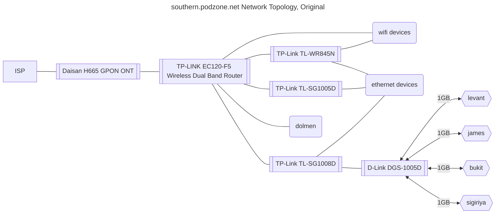
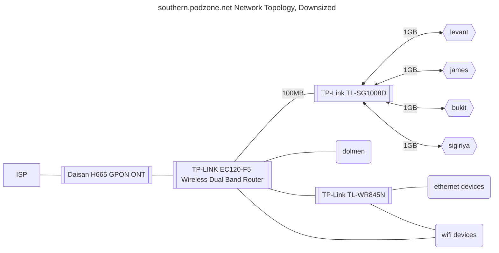
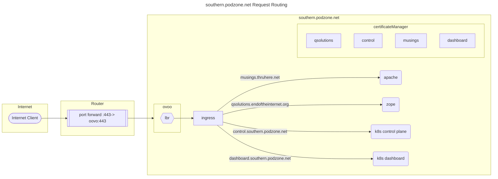
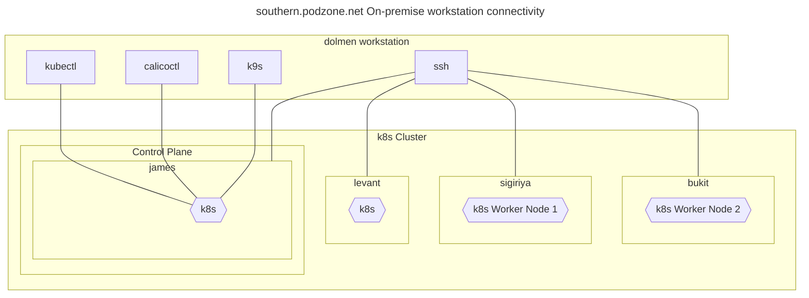

# Consumer Cloud Zone 1: southern.podzone.net

## Tasklists

- [X] Business brief
- [X] Consumer Cloud definition
- [X] Workload Success criteria
- [X] MVP deliverables
- [X] k8s cluster build
- [X] Networking build
- [X] Ingress Build
- [ ] Security
- [ ] Expose k8s dashboard
- [ ] Expose k8s API
- [ ] Applications and Services

### Tasklist: k8s cluster build

- [X] james (upgrade RAM)
- [X] sigiriya (upgrade disk)
- [X] bukit
- [ ] levant (snap issues)

### Tasklist: Networking build

- [X] Network design
- [X] Refactor wired network
- [X] Router config (port forward, dynamic dns)
- [X] https certificate for (qsolutions.endoftheinternet.org)
- [X] Load balancer (MetalLB)
- [X] Router config (port forward, dynamic dns)

### Tasklist: Ingress Build

- [X] Certificate manager
- [X] Certificates  for 4 X LetsEncrypt host certs
- [X] Route to Apache
- [ ] Route to k8s dashboard
- [ ] Route to k8s API
- [ ] Route to zope

### Security

- [ ] enable rbac
- [ ] configure dashboard access
- [ ] user management

### Tasklist: k8s dashboard


### Tasklist: Storage Applications and Services

- [ ] Consolidate assets into iCloud
- [ ] Extract source into GitHub
- [ ] Extract Zope zexp files and check in
- [ ] Containerise Zope, including application code and config
- [ ] Consolidate Web sites

### Tasklist: Extract source into GitHub

- [ ] Book: Telling; BA Colley
- [ ] Book: Cannon Becket; AH Colley
- [ ] Book: All the Saints; AH Colley
- [ ] Code: MicroNode assets
- [ ] Code: BHC assets
- [ ] Code: Archve/Backup search

## Business Brief

## Business Brief: As-is

- Services include QApps Accounting, and line of business functions for property syndication, and property rental closed corporates.
- These are currently running in an Ubuntu VirtualBox client instance hosted on an Ubuntu host.
- Also running in the VirtualBox client is a mail server, serving a static email archive.
- An Apache server is running at OS level on the Ubuntu host, serving static web pages.
- The Ubuntu host runs on-premise, connected to the internet via a fibre router.
- The fibre router provides bukit with a static IP and port forwarding of https traffic on the dynamic WAN address to port 443 for the Apache server, and port 8080 for the Zope listener.
- The static email archive is not accessable from the Internet.
- The hostname "qsolutions.endoftheinternet.org" is resolved to the WAN address using ```DynDns```.
- ```Let's Encrypt``` is used as CA for the SSL certificate.
- Backups are stored on premise, distributed across hosts, with ad-hoc manual copy onto off-premmise media
- Assets (various ownership and type, including images, videos, and documents) are stored on premise, distributed across hosts, with ad-hoc manual copy onto off-premmise media

## Business Brief: To-be

- Consolidation of web apps and content
- Zope and Postgresql forklift (only config)
- Consumer Cloud case study
- Migration of primary premmise (SA to UK)
- Multipremise (SA, UK, EU)
- Distributed Storage for assets
- Backup storage to iCloud
- GitHub for config, docs and code
- Backup GitHub to Storage
- IoT Edge presence on each premmise
- Factor out failed tl-wr845n access point
- Refactor wired network

### Consumer cloud

- No public cloud runtime (d1, d2) dependencies
- Consumer computing resources
- Consumer networking
- Consumer internet access
- Off grid viability for on prem services
- On-premmise services set {full storage, all services}
- Off-premmise (internet facing) services set {storage set, web}

## Workload success criteria

- [ ] https access from on site browser
- [ ] https access from off site browser
- [ ] QApps application server: Generate and View accounting report, Add and view transaction.
- [ ] Mail: Access Medico-Legal mail archive from 3rd party mac client
- [ ] Web: Browse static sites
- [ ] Web: Download ebooks

## MVP deliverables

Containerised Services:

- Zope
- Postgres
- Mail
- Apache

Operationalisation:

- Combine Zope and Apache traffic onto one listener
- Offload qsolutions.endoftheinternet SSL at Apache
- Reverse-proxy Zope
- Send DB backups to iCloud
- Remote admin: Secure external access
- Access cluster from tools on laptop client from internet

## Architecture: southern.podzone.net









### Architecture decisions

- Microk8s Kubernetes distribution
- Build tools (kubectl, calicoctl, ansible etc) on dolmen workstation
- k8s IOT Edge on levant RPi

### Network configuration

- Fibre router: Static IPs for control plane and worker nodes
- Fibre router: (As-is) Dynamic DNS for ```qsolutions.endoftheinternet.org```
- Fibre router: Port forwarding: 443 to k8s service endpoint (As-is goes to dolmen)
- Fibre router: Restrict DHCP IP allocation range for clients to `192.168.0.2 - 192.168.0.120`
- DynDns: Add wildcard for ```*.qsolutions.endoftheinternet.org```
- DynDns: Dynamic DNS for ```*.southern.podzone.net```
- DynDns: Update `*.southern.podzone.net` IP address using ddclient on levant
- MetalLB: IP address range: 192.168.0.131-192.168.0.140

### Ingress configuration

- `kubectl apply -f podzone-certificateIssuer.yaml`
- `kubectl apply -f podzone-qsolutions-certificate.yaml`
- `kubectl apply -f podzone-musings-certificate.yaml`
- `kubectl apply -f podzone-dashboard-certificate.yaml`
- `kubectl apply -f podzone-control-certificate.yaml`
- `kubectl apply -f podzone-ingress.yaml`

### Node installations

- Cleanup prep on each host: sudo snap remove microk8s
- Ubuntu Server and Desktop: `sudo snap install microk8s --classic`
- Ubuntu Core: `sudo snap install microk8s --channel=latest/edge/strict`

- microk8s enable metallb ; Set 192.168.0.131-192.168.0.132
- microk8s enable ingress
- microk8s enable cert-manager

- `kubectl create ingress my-ingress --annotation cert-manager.io/cluster-issuer=letsencrypt --rule 'my-service.example.com/*=my-service:80,tls=my-service-tls'`

```sh
kubectl apply -f podzone-ingress.yaml 
kubectl apply -f podzone-apache.yaml 
kubectl apply -f podzone-certificateIssuer.yaml
kubectl apply -f podzone-qsolutions-certificate.yaml
kubectl apply -f podzone-musings-certificate.yaml
```

- k8s Persistant volumes: NFS, set up on sigiriya with access from `192.168.0.0/24`

- dashboard

```bash
enable dashboard
kubectl port-forward -n kube-system service/kubernetes-dashboard 10443:443
token=$(microk8s kubectl -n kube-system get secret | grep default-token | cut -d " " -f1)
kubectl -n kube-system describe secret $token
```

### deprecated / not clear

- do not enable microk8s ingress: This does not set up the ingress controller, and namespace clashes when adding it - so disable if required

- install ingress-nginx:

- ```sudo microk8s helm upgrade --install ingress-nginx ingress-nginx   --repo https://kubernetes.github.io/ingress-nginx   --namespace ingress-nginx --create-namespace```

- microk8s enable rbac

### Supporting Infrastructure

- `sudo snap install prometheus`: Available on localhost:9090

### k8s node: sigiriya

- Late 2014 Mac Mini
- 2.80GHz i5-4308U (2 core, 4 thread)
- 8GB RAM (soldered)
- Ubuntu Server 22.04 (upgrade from mcOS)
- 2TB SSD (upgrade from 500GB)
- eth0 IP: 192.168.0.6
- eth1 IP:
- dolmen key exchange: ssh colleymj@sigiriya

### k8s node: bukit

- Late 2014 Mac Mini
- 1.4 GHz Dual Core i5
- 4 GB RAM (soldered)
- Ubuntu 22.04
- 500GB SSD
- eth0 IP: 192.168.0.52
- eth1 IP:
- dolmen key exchange: ssh martin@bukit

### k8s node: james

- Motherboard: ASRock H61M-VS3
- 3 GHz Quad Core i5
- 16GB (upgrade from 8 GB) RAM
- Ubuntu 22.04
- 500 GB SSD
- eth0 IP: 192.168.0.27
- eth1 IP:
- dolmen key exchange: ssh colleymj@james

### k8s lbr: oovo

- MetalLBR L2 (ARP) Load balancer
- IP: 192.168.0.131

### k8s node: levant

- Raspberry Pi 4 B
- 1.8GHz Broadcom BCM2711, Quad Core Cortex-A72
- 4GB RAM
- Ubuntu Core 22
- IP: 192.168.0.28

### Admin Client: dolmen

- MacBook Pro
- Apple M1
- 16GB RAM
- macOs Ventura 13.5.2

## Appendices

### Appendix 1: /etc/hosts

- Add `/etc/hosts` file entries on servers
- Add `/private/etc/hosts` for Mac clients

```text
192.168.0.52 bukit
192.168.0.27 james
192.168.0.28 levant
192.168.0.18 dolmen
192.168.0.6  sigiriya
192.168.0.131 ovoo
192.168.0.132 inuksuk
```

### Appendix 2: wildcard hostnames

- central.podzone.net
- western.podzone.net
- southern.podzone.net
- control.podzone.net
- northern.podzone.net
- eastern.podzone.net
