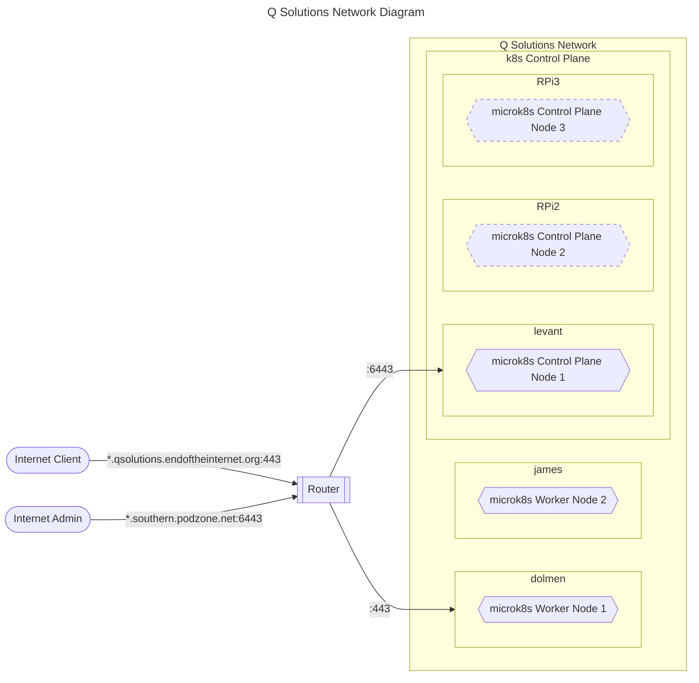

# QSolutions Applications server

## Tasklists


### Tasklists: Application

- [ ] Extract Zope zexp files and check in
- [ ] Containerise Zope, including application code and config

## Business Brief

## Business Brief: As-is

- Services include QApps Accounting, and line of business functions for property syndication, and property rental closed corporates.
- These are currently running in an Ubuntu VirtualBox client instance hosted on an Ubuntu host called "bukit".
- Also running in the VirtualBox client is a mail server, serving a static email archive.
- An Apache server is running at OS level on the Ubuntu host, serving static web pages.
- The Ubuntu host runs on-premise, connected to the internet via a fibre router.
- The fibre router provides bukit with a static IP and port forwarding of https traffic on the dynamic WAN address to port 443 for the Apache server, and port 8080 for the Zope listener.
- The static email archive is not accessable from the Internet.
- The hostname "qsolutions.endoftheinternet.org" is resolved to the WAN address using ```DynDns```.
- ```Let's Encrypt``` is used as CA for the SSL certificate.
- Backups are stored on premise, distributed across hosts, with ad-hoc manual copy onto off-premmise media
- Assets (various ownership and type, including images, videos, and documents) are stored on premise, distributed across hosts, with ad-hoc manual copy onto off-premmise media

## Business Brief: To-be

- Prepare for shut-down of primary premmise
- Technical: High Availability, multi-site, consumer network, consumer hardware, opensource everything
- Technical: Secure site management from off-site
- Technical: Kubernetes case study
- Technical: Containerise workload

## Minimum Viable Product  (MVP) and End Game (EG) Roadmap

- MVP: Containerise all services
- MVP: Manage services using k8s
- MVP: k8s cluster on premise
- MVP: Configuration management: git; ansible; helm
- EG: Log aggregation
- EG: On prem TLS
- EG: Multi-zone cluster: sothern, central, western

## Workload success criteria

- [ ] https access from on site browser
- [ ] https access from off site browser
- [ ] QApps application server: Generate and View accounting report, Add and view transaction.
- [ ] Mail: Access Medico-Legal mail archive from 3rd party mac client
- [ ] Web: Browse static pages, download ebook.

## MVP deliverables

Containerised Services:

- Zope
- Postgres
- Mail
- Apache
- jenkins

Operationalisation:

- Combine Zope and Apache traffic onto one listener
- Offload qsolutions.endoftheinternet SSL at Apache
- Reverse-proxy Zope
- Send DB backups to iCloud
- Remote admin: Secure external access
- Access cluster from tools on laptop client from internet

## Architecture: Southern Zone



### Architecture decisions

- Set up new domains ```{central,southern,western}.podzone.net```  for kubernetes
- Microk8s for control plane and worker nodes
- Build tools (docker, kubectl, ansible etc) on dev clients dolmen (MacOs) + 1?
- Single node stacked k8s control plane on levant.
- Additional k8s control plane nodes on RPi 4Bs
- Worker nodes on james and bukit
- Create admin account qappadmin on all machines

### Network configuration

- Fibre router: Static IPs for control plane and worker nodes
- Fibre router: (As-is) Dynamic DNS for ```qsolutions.endoftheinternet.org```
- Fibre router: Port forwarding: 443 to k8s service endpoint (As-is goes to dolmen)
- Fibre router: Restrict DHCP IP allocation range for clients to `192.168.0.2 - 192.168.0.120`
- DynDns: Add wildcard for ```*.qsolutions.endoftheinternet.org```
- DynDns: Dynamic DNS for ```*.southern.podzone.net```
- DynDns: Update `*.southern.podzone.net` IP address using ddclient on levant

### Node installations

- Cleanup prep on each host: sudo snap remove microk8s
- sudo snap install microk8s --classic
- microk8s enable ingress
- k8s Persistant volumes: NFS, set up on sigiriya with access from `192.168.0.0/24`


### DynDns hostnames, with automatic wildcard aliases

- central.podzone.net
- western.podzone.net
- southern.podzone.net
- control.podzone.net
- northern.podzone.net
- eastern.podzone.net

### k8s control plane node: sigiriya

- Late 2014 Mac Mini
- 2.80GHz i5-4308U (2 core, 4 thread)
- 8GB RAM
- Ubuntu Server 22.04
- IP: 192.168.0.6
- dolmen key exchange: ssh colleymj@sigiriya

### k8s control plane node: bukit

- Late 2014 Mac Mini
- 1.4 GHz Dual Core i5
- 4 GB RAM
- Ubuntu 22.04
- 500GB SSD
- IP: 192.168.0.52
- dolmen key exchange: ssh martin@bukit

### k8s control plane node: james

- Motherboard: ASRock H61M-VS3
- 3 GHz Quad Core i5
- 8 GB RAM
- Ubuntu 22.04
- 500 GB SSD
- IP: 192.168.0.27
- dolmen key exchange: ssh colleymj@james


### Test Client: levant

- Raspberry Pi 4 B
- 1.8GHz Broadcom BCM2711, Quad Core Cortex-A72
- 4GB RAM
- Ubuntu Core 22
- IP: 192.168.0.28

### Admin Client: dolmen

- dolmen: MacBook Pro, macOS
- levant: 

## Networking

- For MVP, set bukit up as control plane entry point, as well as ingress entry point.
- Add james entry for convenience
- Add `/etc/hosts` file entries on servers
- Add `/private/etc/hosts` for Mac clients

```text
192.168.0.52 bukit
192.168.0.27 james
192.168.0.28 levant
192.168.0.18 dolmen
192.168.0.6  sigiriya
```


## Containerd installation and configuration

Full docker stack, packaged by docker: ```sudo apt-get install docker-ce docker-ce-cli containerd.io docker-buildx-plugin docker-compose-plugin```

Just runc and containerd, packaged by ubuntu: ```apt-get -y install containerd```

Containerd configuration requirements:

- Enable cri plugin in /etc/containerd/config.toml (achieved by overwriting the default file config.toml)
- Set cgroup driver to Systemd
- Configure k8s sandbox image

The following achieves this:

```text
cat > /etc/containerd/config.toml <<EOF
[plugins."io.containerd.grpc.v1.cri".containerd.runtimes.runc]
  [plugins."io.containerd.grpc.v1.cri".containerd.runtimes.runc.options]
    SystemdCgroup = true
[plugins."io.containerd.grpc.v1.cri"]
  sandbox_image = "registry.k8s.io/pause:3.9"
EOF
```

Restart containerd: ```systemctl restart containerd```

## kubeadm installation and configuration

- Set Pod subnet (--pod-network-cidr): 192.168.1.0/24
- Set Service subnet 192.168.0.0/24
- Set --control-plane-endpoint bukit
- Set systemd as the cgroup driver
- Since the config file option to init is required for cgroup driver, create a config file for all options:

```text
kind: ClusterConfiguration
apiVersion: kubeadm.k8s.io/v1beta3
kubernetesVersion: v1.28.2
networking:
  serviceSubnet: "192.168.0.0/24"
  podSubnet: "192.168.1.0/24"
  dnsDomain: "cluster.local"
controlPlaneEndpoint: "bukit"
clusterName: "qapps-cluster"
---
kind: KubeletConfiguration
apiVersion: kubelet.config.k8s.io/v1beta1
cgroupDriver: systemd
```

- Init command: kubeadm init --config kubeadm-config.yaml

### Tasks: Cleanup to retdo kubeadm init

- kubectl drain <node name> --delete-emptydir-data --force --ignore-daemonsets
- kubeadm reset 
- kubectl delete node <node name>

- clean /etc/cni/net.d

